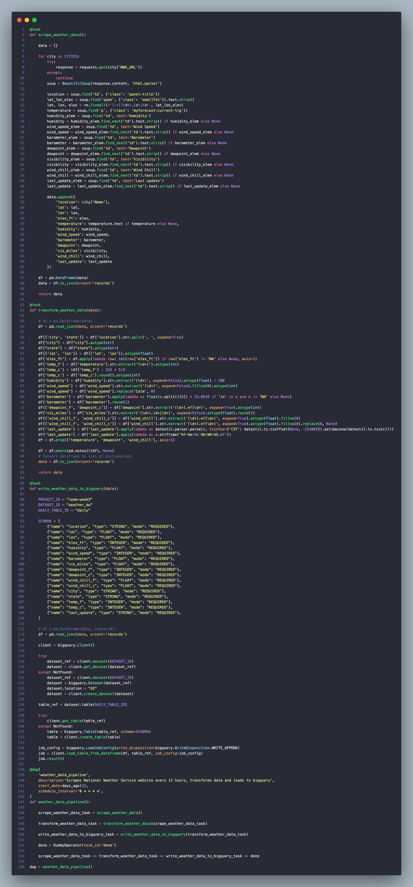
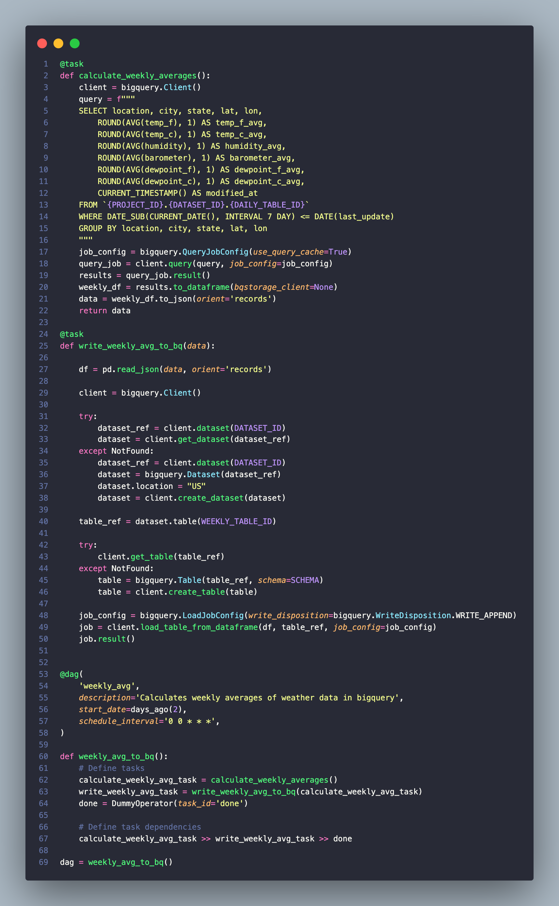

## National Weather Service Web Scrape and ETL
#### By [Drew White](https://www.linkedin.com/in/drew-riley-white/)

#### Scraping and transforming daily weather data from the National Weather Service and taking that data to perform weekly aggregations.

## Technologies Used

* Python
* Apache Airflow
* Pandas
* BeautifulSoup
* Google BigQuery

 

## Sources:
_A dictionary of the sources of the city weather data:_

## Description:
## dw_weather_scrape.py

* `scrape_weather_data`
    - Uses BeautifulSoup to scrape National Weather Service and put into Pandas data frame.
* `transform_weather_data`
    - Takes Pandas data frame and makes transformations on data to create more usable values.
* `write_weather_data_to_bq`
    - Writes the scraped/transformed data to Google BigQuery daily appending on to existing `daily` table.

### Daily Schema:

## dw_weekly_avg.py

* `calculate_weekly_averages`
    - Pulls `daily` data from BigQuery and gets averages of select columns.
* `write_weekly_avg_to_bq`
    - Writes averages to BigQuery on weekly schedule to `weekly_avg` table.

### Weekly Avg Schema:

 

## Known Bugs

* No known bugs

 

_If you find any issues, please reach out at: **d.white0002@gmail.com**._

Copyright (c) _2023_ _Drew White_

 